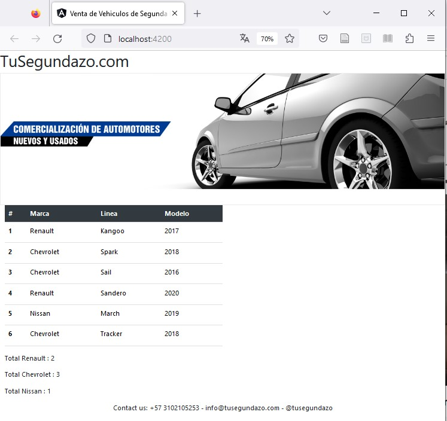
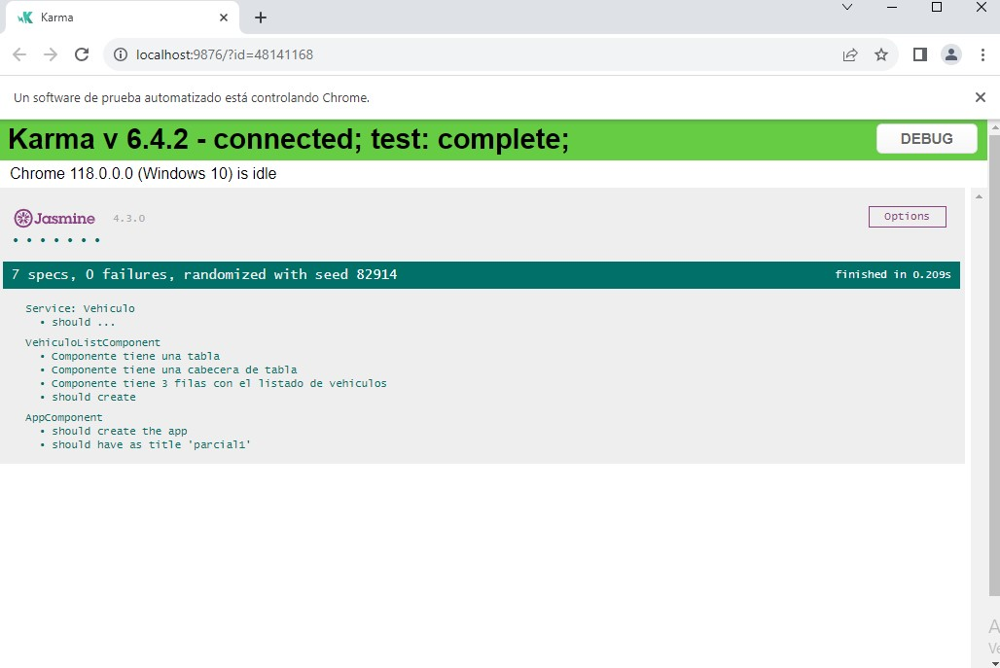

# Parcial_1_Angular_2023
Parcial 1 Asignatura Angular Universidad de los Andes Nelson Ortiz

<h1> Instrucciones de Ejecución </h1>

 1.	Clonar el repositorio
2.	Una vez descargado, abrir Visual Studio Code y abrir la terminal. Ubicarse en el folder parcial1.
3.	Ejecutar el comando <b>npm install </b>
4.	Una vez terminado, ejecutar el comando <b>  ng serve –o </b> para arrancar la aplicación:

<h1>Ejecución de Pruebas</h1>

1.	Abra de nuevo la terminal en el folder parcial1 del proyecto y ejecute el comando ng test. Dado que se está trabajando con generación de datos aleatorios con Faker, en caso de ser necesario instalar la librería Faker con el comando:
<b>
npm install @faker-js/faker --save-dev
</b>
2.	Se abrirá una nueva ventana con la ejecución de las pruebas con el siguiente resultado:

3.	La validación de la creación de los 3 registros, la cabecera y la tabla está en la opción de VehiculoListComponent.